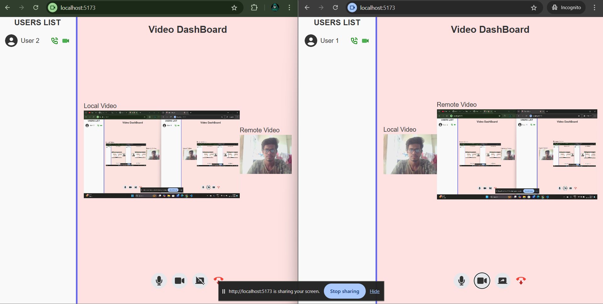

# Peer-to-Peer Calling with Screen Sharing (MERN Stack)

This repository is a real-time peer-to-peer video calling application built with the **MERN** stack. It leverages the **simple-peer** library to establish WebRTC connections, enabling seamless one-on-one video calling.

## Key Features:

- **Real-Time Video Calling**: Peer-to-peer communication for live video chats without the need for a server to relay video streams.
- **Screen Sharing**: Users can share their screen during calls, making it easy to demonstrate applications, presentations, or collaborate remotely.
- **Simple-Peer Integration**: Utilizes the **simple-peer** library for establishing WebRTC connections, making the setup process more efficient and straightforward.
- **Frontend with React**: The user interface is built with React, providing a smooth, responsive, and dynamic experience for users.
- **Backend with Node.js and Express**: Handles signaling, user management, and real-time communication using **Socket.io**.

## Tech Stack:

- **Frontend**: React, HTML5, CSS
- **Backend**: Node.js, Express.js
- **WebRTC**: simple-peer (for peer-to-peer connections)
- **Signaling Server**: Socket.io (for WebSocket communication)

## How to Run:

1. Clone the repository.
   `git clone https://github.com/CoderSwarup/peer-to-peer-calling-MERN.git`
2. Install dependencies for both the backend and frontend:
   - Run `npm install` in the `client` folder.
   - Run `npm install` in the `server` folder.
3. Start the backend server by running `npm run dev` in the `server` folder.
4. Start the frontend client by running `npm run dev` in the `client` folder.

## Conclusion:

This project showcases an implementation of WebRTC-based peer-to-peer video calling with screen sharing, all built with modern technologies. Whether you're looking to create a similar application or learn more about WebRTC, this repository provides a solid foundation.
